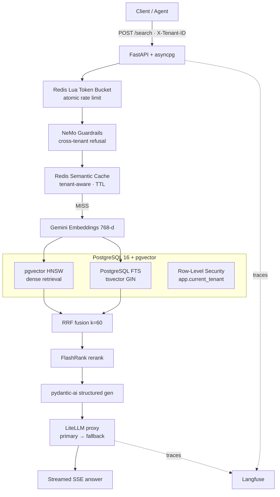
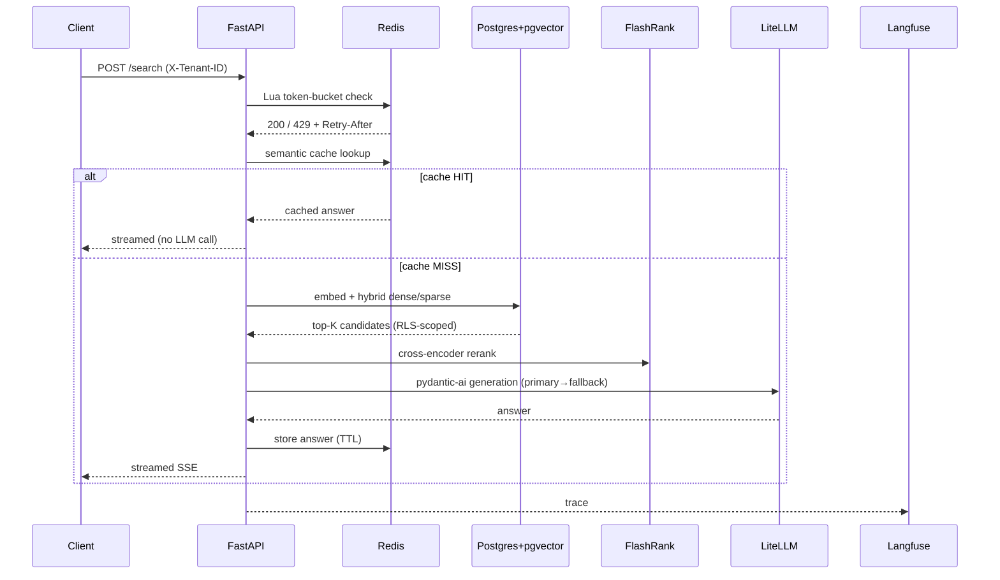
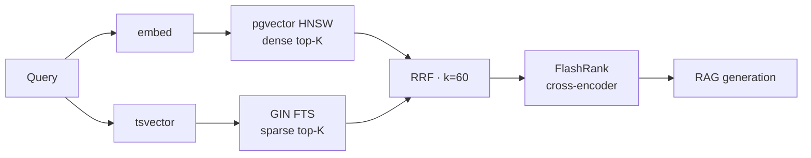

# Enterprise RAG Gateway

**A production-oriented, multi-tenant Retrieval-Augmented Generation (RAG) gateway** — secure by default, hybrid-search accurate, cost/latency aware, and fully observable.

Built with **FastAPI + asyncpg + PostgreSQL 16 / pgvector (HNSW) + Redis (Lua) + LangChain + FlashRank + pydantic-ai + LiteLLM + NeMo Guardrails + Langfuse**, running in Docker Compose.

> Project 1 of 3 in the **"Distributed Agentic Infrastructure Suite"** — this is the **Data & Context Plane** that serves other systems (agents) with tenant-isolated, grounded, streamed answers.

---

## 🌐 Live Deployment

| Link | Status |
|------|--------|
| **Live URL** | ⏳ Pending — provider decision (Render / Railway / AWS) in progress |
| **Loom demo** | ⏳ To be recorded once deployed |

> Local functional, performance, security, and observability checks **all pass** (evidence below). A live URL + Loom walkthrough will be added here after deployment completes.

---

## ✨ Highlights

- **Multi-tenant isolation at the DATABASE layer** — PostgreSQL **Row-Level Security (RLS)** with `FORCE ROW LEVEL SECURITY` + `SET LOCAL app.current_tenant` (asyncpg). Cross-tenant reads are impossible even if an application `WHERE` clause is ever forgotten. **Proven by an API test:** content ingested by tenant `...001` is not retrievable by tenant `...111`.
- **Hybrid retrieval that is actually fast** — dense (**pgvector HNSW**, `vector_cosine_ops`) fused with sparse (**PostgreSQL full-text search / GIN tsvector**) via **Reciprocal Rank Fusion (RRF, k=60)** → re-ranked by a **cross-encoder (FlashRank)** before generation. Measured **RRF ≈ 1.24 ms avg** and **FlashRank ≈ 16.9 ms avg**.
- **Two Redis-backed production guards** — an **atomic Lua token-bucket rate limiter** (no TOCTOU race under concurrency) and a **tenant-aware semantic response cache** (invalidated on re-ingest).
- **Provider resilience** — all LLM calls route through a **LiteLLM proxy** with a **primary → fallback** model chain (verified live by breaking the primary).
- **Safety rails** — **NeMo Guardrails** blocks prohibited cross-tenant requests before retrieval (`X-Guardrail: BLOCKED`).
- **Observability from request to token** — **Langfuse** tracing on every request path (verified live).
- **Structured, streaming output** — pydantic-ai structured generation streamed over **SSE**.

---

## 🏗️ Architecture



### Request flow (`/search`)



### Retrieval pipeline



---

## 🔒 Security Model

- **Row-Level Security (RLS):** `ENABLE + FORCE` on `documents` and `embeddings`; policy reads `current_setting('app.current_tenant', true)::uuid`. The app runs each request inside a transaction after `SET LOCAL app.current_tenant = '<tenant>'` — the engine itself pre-filters rows, so no application misconfiguration can leak data.
- **NeMo Guardrails:** the `/search` path classifies intent and refuses prohibited cross-tenant requests before retrieval. Blocked responses return `X-Guardrail: BLOCKED` + `X-Cache: BYPASS` with a refusal message.
- **Rate limiting:** Redis **Lua token bucket** (atomic read→refill→check→decrement), per-tenant — capacity `10`, refill `2/s`. A concurrent burst test returned both `200` and `429`, proving enforcement.
- **No secrets in code:** all keys via environment (`.env`, ignored by git).

---

## 🧰 Tech Stack

| Layer | Technology |
|-------|-----------|
| API | FastAPI · asyncpg (pooled) · pydantic-ai |
| Vector / Search | PostgreSQL 16 + pgvector **HNSW** (`vector_cosine_ops`) · GIN `tsvector` FTS · **RRF (k=60)** |
| Rerank | FlashRank (cross-encoder) |
| Caching / Rate limit | Redis 7 (semantic cache + **Lua** token bucket) |
| Chunking | LangChain `RecursiveCharacterTextSplitter` (Parent→Child) |
| Models / Routing | LiteLLM proxy (Gemini **primary → fallback**) · Gemini 768-d embeddings |
| Safety | NeMo Guardrails |
| Observability | Langfuse (OTel) |
| Infra | Docker Compose (app · postgres · redis · litellm) |

---

## 📁 Project Structure

```
enterprise-rag-gateway/
├── main.py                 # FastAPI app, Langfuse middleware, routers
├── docker-compose.yml      # postgres(pgvector) · redis · litellm · app
├── Dockerfile
├── litellm_config.yaml     # primary/fallback model routes
├── requirements.txt
├── .env.example
├── core/
│   ├── config.py           # env-driven settings
│   └── lifespan.py         # startup/shutdown (pools)
├── models/                 # pydantic schemas
├── routers/
│   ├── health.py           # GET /health
│   ├── ingest.py           # POST /ingest (async background)
│   └── search.py           # POST /search (SSE)
├── services/
│   ├── chunker.py          # LangChain recursive splitter
│   ├── embeddings.py       # Gemini 768-d
│   ├── guardrails.py       # NeMo cross-tenant refusal
│   ├── llm.py              # LiteLLM + pydantic-ai
│   ├── rate_limiter.py     # Redis Lua token bucket
│   ├── reranker.py         # FlashRank
│   └── semantic_cache.py   # tenant-aware Redis cache
├── guardrails/             # NeMo config
└── sql/schema.sql          # tables + RLS + HNSW/GIN indexes
```

---

## 🚀 Quick Start

```bash
# 1. Configure credentials (never commit real keys)
cp .env.example .env
# fill GOOGLE_API_KEY, LANGFUSE_* , LITELLM_MASTER_KEY

# 2. Build + start the full stack
docker compose up -d --build

# 3. Verify
docker compose ps
curl -i http://localhost:8000/health
# {"status":"ok","database":"ok","redis":"ok"}
```

Stop with `docker compose down`.

---

## 📡 API Reference

### `GET /health`
```bash
curl -i http://localhost:8000/health
```
```json
{"status":"ok","database":"ok","redis":"ok"}
```

### `POST /ingest`
```bash
curl -i http://localhost:8000/ingest \
  -H "X-Tenant-ID: 00000000-0000-0000-0000-000000000001" \
  -H "Content-Type: application/json" \
  -d '{"source_id": 1, "content": "Document content to index"}'
```
Ingestion is accepted immediately (background task), chunked → embedded → stored tenant-scoped, and **invalidates that tenant's semantic cache**.

### `POST /search` (SSE)
```bash
curl -N http://localhost:8000/search \
  -H "X-Tenant-ID: 00000000-0000-0000-0000-000000000001" \
  -H "Content-Type: application/json" \
  -d '{"query": "What is the refund policy?", "limit": 5}'
```
Streamed Server-Sent Events; answer chunks follow `data:` frames and end with `data: [DONE]`.

---

## ⚡ Performance Evidence

Component-level measurements taken against the **running Dockerized implementation** (10 runs each):

| Step | Min | Max | Avg | Target | Result |
|------|-----|-----|-----|--------|--------|
| Hybrid / RRF retrieval | 0.91 ms | 1.84 ms | **1.24 ms** | <200 ms | ✅ PASS |
| FlashRank rerank | 10.01 ms | 25.61 ms | **16.92 ms** | <50 ms | ✅ PASS |

> These are component-level latencies, not end-to-end `/search` figures.

---

## 🔭 Observability

**Langfuse** wraps the request path. A real `/search` produced a live observation:

```
Name: POST /search
Trace ID: ec3d8db94077b5050454c90e7bf79d1a
```

Every request (HTTP span → guardrail → retrieval → LLM) is traceable end-to-end, enabling per-tenant cost/latency analysis.

---

## ✅ Verified (deployment-gate checklist)

- `/health` (database + Redis)
- `/ingest` real document flow
- `/search` normal RAG flow (real provider)
- PostgreSQL **tenant isolation** (cross-tenant → no rows)
- **NeMo Guardrails** refusal
- Redis **token-bucket** rate limiting (`200` + `429` seen)
- **LiteLLM primary → fallback** routing (verified by breaking the primary)
- **Semantic cache** behavior (identical second query = cache hit, no second LLM call)
- RRF + FlashRank performance (PASS)
- Langfuse request observation

---

## ⚠️ Known Limitations

- The SSE implementation can emit the generated answer more than once before `data: [DONE]` — acknowledged, targeted for refinement.
- Live deployment URL + Loom not yet available (deployment gate in progress — provider decision pending after a Render free-tier memory constraint).

---

## 🗺️ Roadmap

- [ ] Resolve deploy provider (Render / Railway / AWS) → live URL + Loom
- [ ] Fix duplicate SSE emission before `[DONE]`
- [ ] Two-phase LLM quota reserve/settle via LiteLLM (cost governance)
- [ ] NeMo Guardrails harden + full OWASP MCP-aware perimeter (P2 ties in)

---

*P1 — Enterprise RAG Gateway · Distributed Agentic Infrastructure Suite (Data & Context Plane)*
